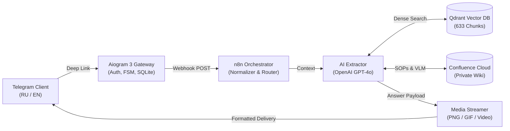

<p align="right">
  <b>English</b> | <a href="README_RU.md">Русский</a>
</p>

# AxonBot: Enterprise AI BIM Consultant for Autodesk Revit Structural (KR)

[](https://www.python.org/downloads/)
[](https://docs.aiogram.dev/)
[](https://qdrant.tech/)
[](https://www.docker.com/)

> **AxonBot** is an autonomous, production-grade AI engineering consultant designed for high-load structural engineering departments. It ingests **100+ corporate BIM standards, fabrication guidelines, and parametric family manuals**, delivering instant technical answers with verbatim parameter citations, visual schematics, and strict compliance checking.

> **Video Walkthrough**: Watch the [2.5-Minute Live Demo](https://youtu.be/70uFZETkw-g) showcasing Cross-Lingual RAG, automated schematic delivery, and deterministic compliance refusals.  
> **Live Production Bot**: [@bim_axonbot](https://t.me/bim_axonbot?start=github).

---

## System Architecture



---

## Key Engineering Innovations

### 1. Cross-Lingual Retrieval-Augmented Generation
- **Native Dual-Language Capability**: International clients can submit complex technical questions in **English**, while the underlying enterprise knowledge base is indexed in **Russian**.
- **Strict Cyrillic Verbatim Constraint**: Preserves proprietary Cyrillic Revit family identifiers (`201_Свая...`, `266_АрмСтены...`), shared parameters (`ADSK_...`, `231_Отверстие_...`), and structural worksets literally without translation artifacts.
- **Visual SOP & Media Delivery**: Pairs technical answers with visual instructions embedded in manuals (UI panel screenshots, viewport schematics, step-by-step animated GIFs, and video clips) along with contextual attachment captions.

### 2. Multi-Criteria Verification & Benchmarking
- Evaluated against a rigorous suite of **over 60 automated benchmark scenarios** covering complex reinforcement detailing, pile fields, in-place modeling, and out-of-scope boundary testing via an asynchronous **LLM-as-a-Judge** pipeline.
- **Production Metrics**:
  - **Composite Benchmark Score**: **97.0%** across 60+ benchmark scenarios.
  - **Parameter Extraction Accuracy**: **96.4%** (verbatim parameter and mask extraction).
  - **Media Integrity**: **100.0%** (exact schematics and animated SOP delivery verified against benchmark specifications).
  - **Average Latency**: **4.3s – 5.1s**.
  - **Deterministic Out-of-Scope Refusal**: 100% rejection rate for external FEA software (Robot, SCAD) and non-structural disciplines without dangling citations.

### 3. OpSec & Access Control Architecture
- **Aiogram 3 Whitelist Middleware**: Protects proprietary enterprise intellectual property. Guests see a presentation card and submit access applications.
- **Admin Approval Workflow**: Delivers incoming access requests directly to administrators with instant one-click approval inline keyboards.
- **Encapsulated Content Delivery**: Atlassian API credentials remain strictly on backend servers; media files and animated SOPs are transcoded and proxied in-memory without disk leakage.

---

## Representative Test Scenarios (from 60+ Benchmark Suite)

> The following cases represent real-world queries evaluated against the comprehensive 60+ automated benchmark suite (covering reinforcement detailing, monolithic assemblies, naming conventions, and strict compliance boundaries).

| ID | Domain | Case Query | Latency | Delivery |
| :---: | :--- | :--- | :---: | :---: |
| <code>ST&#8209;03</code> | Piles & Foundations | *«I have a pile field with 800 piles, how do I quickly distribute them along grid lines and what parameter controls the head cut-off?»* | **4.36s** | 3 Schematics |
| <code>ST&#8209;09</code> | Rebar Detailing | *«How to model a bent rebar with a custom hook without losing shape parameters in schedules?»* | **5.18s** | 6 Layout drawings |
| <code>ST&#8209;11</code> | Slab Reinforcement | *«What rebar role in instance properties should be chosen when placing the top slab background mesh?»* | **4.20s** | 2 Schematics |
| <code>ST&#8209;13</code> | Dowels & Starters | *«How should starter bar dowels from foundation slabs be annotated on plans and sections, which family is used?»* | **4.85s** | 1 Annotation family |
| <code>ST&#8209;16</code> | Rebar Chairs | *«Which family is prescribed for modeling bar chairs (spacers) and how should they be positioned?»* | **4.40s** | 1 Rebar family |
| <code>ST&#8209;22</code> | View Templates | *«Which view template must be used for formwork sections of cast-in-place stairs?»* | **4.15s** | 2 Layout sheets |
| <code>ST&#8209;25</code> | Naming Standards | *«What naming mask is used for monolithic wall and column types in the project?»* | **4.22s** | 1 Standard table |
| <code>ST&#8209;30</code> | Precast Schedules | *«What filters should be configured in structural schedules to separate precast from cast-in-place concrete?»* | **4.90s** | 1 Schedule spec |

---

## Quickstart & Deployment

### Primary Deployment: Docker Compose
The recommended production setup packages the bot as an isolated container with declarative resource limits:

1. **Clone and Configure**:
   ```bash
   git clone https://github.com/IvanKiryushov/axon.git /opt/AxonBot
   cd /opt/AxonBot
   cp .env.example .env
   nano .env  # Configure environment variables according to .env.example
   ```

2. **Launch Container**:
   ```bash
   docker compose up -d --build
   ```

### Alternative: Native Linux Service (systemd daemon)
For environments requiring direct host execution alongside n8n with an ultra-low footprint (**~45 MB RAM**):

```bash
python3 -m venv .venv
source .venv/bin/activate
pip install -r requirements.txt

sudo cp axonbot.service /etc/systemd/system/
sudo systemctl daemon-reload
sudo systemctl enable --now axonbot.service
```

---

## Technology Stack

- **Core Engine**: Python 3.11+, Aiogram 3.19, aiosqlite (ACID storage), aiohttp.
- **Workflow & Orchestration**: n8n (declarative graph pipelines in `workflows/`).
- **Vector Search**: Qdrant Vector Engine (633 Micro-chunk Merged points, HNSW cosine index).
- **Large Language Models**: OpenAI GPT-4o, Google Gemini Flash pool.
- **Visual Intelligence**: Multi-Frame VLM (Gemini) enrichment for technical diagrams and UI screenshots via Confluence Content Properties API.
- **Testing & QA**: Pytest, Asyncio, Custom LLM-as-a-Judge Evaluation Framework.
