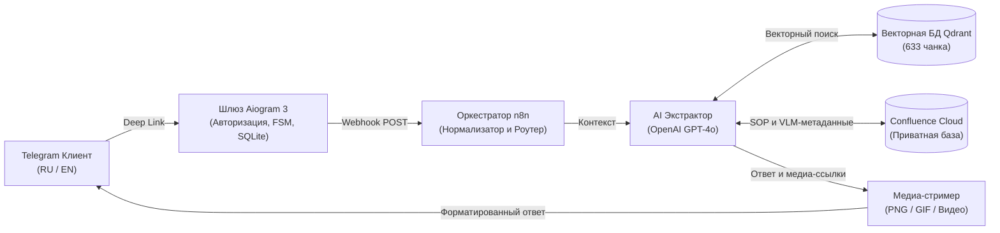

<p align="right">
  <a href="README.md">English</a> | <b>Русский</b>
</p>

# AxonBot: Корпоративный AI-консультант по стандартам Autodesk Revit (КР)

[](https://www.python.org/downloads/)
[](https://docs.aiogram.dev/)
[](https://qdrant.tech/)
[](https://www.docker.com/)

> **AxonBot** — автономный производственный AI-консультант для проектных институтов и девелоперских компаний. Система индексирует **более 100 корпоративных регламентов по разделу КР, инструкций по армированию и параметрическим семействам Revit**, выдавая мгновенные инженерные ответы с точным цитированием параметров, чертежами узлов и строгим нормативным комплаенсом.

> **Видео-демонстрация**: Посмотрите [2.5-минутный скринкаст](https://youtu.be/70uFZETkw-g) с показом кросс-языкового RAG, нативной доставки чертежей и регламентных отказов.  
> **Продакшен-бот в Telegram**: [@bim_axonbot](https://t.me/bim_axonbot?start=github).

---

## Архитектура системы



---

## Ключевые инженерные решения

### 1. Кросс-языковой поиск (Cross-Lingual RAG)
- **Двуязычный контур**: Международные пользователи могут задавать сложные инженерные вопросы на **английском языке**, в то время как корпоративная база знаний проиндексирована на **русском языке**.
- **Сохранение проектных идентификаторов**: Строгое сохранение кириллических имен семейств (`201_Свая...`, `266_АрмСтены...`), общих параметров (`ADSK_...`, `231_Отверстие_...`) и рабочих наборов в бэктиках без машинного искажения.
- **Доставка визуальных регламентов (SOP)**: Автоматическая отправка визуальных инструкций из регламентов (скриншоты панелей/интерфейса Revit, видового экрана, пошаговые GIF-алгоритмы моделирования и видео) с контекстными метакомментариями к каждому вложению.

### 2. Многокритериальный бенчмаркинг и контроль качества
- Система верифицирована на сьюте из **более чем 60 автоматических сценариев**, охватывающих узлы сопряжений, раскладку свай, моделирование в контексте и границы предметной области через асинхронный пайплайн **LLM-as-a-Judge**.
- **Метрики качества**:
  - **Комплексный балл (Composite Score)**: **97.0%** по 60+ сценариям.
  - **Точность извлечения параметров**: **96.4%** (буквальное извлечение атрибутов и масок).
  - **Целостность медиа-выдачи**: **100.0%** (строгая доставка оригинальных чертежей и анимированных SOP).
  - **Средняя задержка ответа**: **4.3с – 5.1с**.
  - **Регламентный отказ (Out-of-Scope)**: 100% отказ по сторонним расчетным комплексам (SCAD, Robot) и смежным разделам без галлюцинированных ссылок.

### 3. Безопасность данных и контроль доступа (OpSec)
- **Aiogram 3 Whitelist Middleware**: Защита корпоративной интеллектуальной собственности. Гости видят презентационную карточку и заполняют двухшаговую заявку.
- **Интерактивная модерация доступа**: Мгновенная доставка заявок гостей администраторам с inline-кнопками одобрения в один клик.
- **Изоляция учетных данных**: Токены Atlassian и приватные эндпоинты остаются строго на сервере; чертежи и анимации стримятся в Telegram через оперативную память.

---

## Примеры тестовых сценариев (из сьюта 60+ тестов)

> Ниже представлены показательные практические кейсы, отобранные из полного тестового сьюта бенчмарка (армирование, монолитные конструкции, правила именования и нормативные ограничения).

| ID | Раздел | Пример вопроса | Время | Доставка |
| :---: | :--- | :--- | :---: | :---: |
| <code>ST&#8209;03</code> | Свайные поля | *«У меня свайное поле на 800 свай, как быстро раскопировать по сетке и какой параметр отвечает за срубку голов?»* | **4.36с** | 3 схемы |
| <code>ST&#8209;09</code> | Армирование | *«Как замоделировать гнутый стержень с нестандартным крюком, чтобы не слетели параметры формы в спецификации?»* | **5.18с** | 6 чертежей |
| <code>ST&#8209;11</code> | Армирование плит | *«Какую роль арматуры в свойствах экземпляра выбрать при раскладке фоновой сетки плиты?»* | **4.20с** | 2 схемы |
| <code>ST&#8209;13</code> | Выпуски арматуры | *«Как правильно оформить выпуски из фундаментной плиты на планах и разрезах, какое семейство используется?»* | **4.85с** | 1 аннотация |
| <code>ST&#8209;16</code> | Фиксаторы сеток | *«Какое семейство регламентировано для моделирования "лягушек" и как они расставляются?»* | **4.40с** | 1 семейство |
| <code>ST&#8209;22</code> | Шаблоны видов | *«Какой шаблон вида назначить для опалубочного разреза монолитной лестницы?»* | **4.15с** | 2 листа |
| <code>ST&#8209;25</code> | Именование типов | *«Какая маска используется для монолитных стен и пилонов в проекте?»* | **4.22с** | 1 таблица |
| <code>ST&#8209;30</code> | Спецификации ЖБК | *«Какие фильтры настроить в спецификации, чтобы отделить сборные элементы от монолита?»* | **4.90с** | 1 ведомость |

---

## Развертывание и быстрый старт

### Основной способ: Docker Compose
Рекомендуемый продакшн-метод запуска бота в изолированном контейнере с декларативным управлением ресурсами:

1. **Клонирование и настройка**:
   ```bash
   git clone https://github.com/IvanKiryushov/axon.git /opt/AxonBot
   cd /opt/AxonBot
   cp .env.example .env
   nano .env  # Настройте токены и параметры по шаблону .env.example
   ```

2. **Запуск сервиса**:
   ```bash
   docker compose up -d --build
   ```

### Альтернатива: Нативный Linux-демон (systemd)
Для сред, где требуется прямой запуск на хосте рядом с n8n с ультранизким потреблением ресурсов (**~45 МБ RAM**):

```bash
python3 -m venv .venv
source .venv/bin/activate
pip install -r requirements.txt

sudo cp axonbot.service /etc/systemd/system/
sudo systemctl daemon-reload
sudo systemctl enable --now axonbot.service
```

---

## Стек технологий

- **Ядро сервиса**: Python 3.11+, Aiogram 3.19, aiosqlite (ACID-хранилище), aiohttp.
- **Оркестрация RAG**: n8n (декларативные JSON-графы в папке `workflows/`).
- **Векторное хранилище**: Qdrant Vector Engine (633 склеенных микро-чанка, косинусный HNSW-индекс).
- **Языковые модели**: OpenAI GPT-4o, Google Gemini Flash pool.
- **Компьютерное зрение (VLM)**: Предварительное Multi-Frame VLM (Gemini) обогащение чертежей и интерфейсов через Confluence Content Properties API.
- **Тестирование и QA**: Pytest, Asyncio, асинхронный фреймворк LLM-as-a-Judge.
